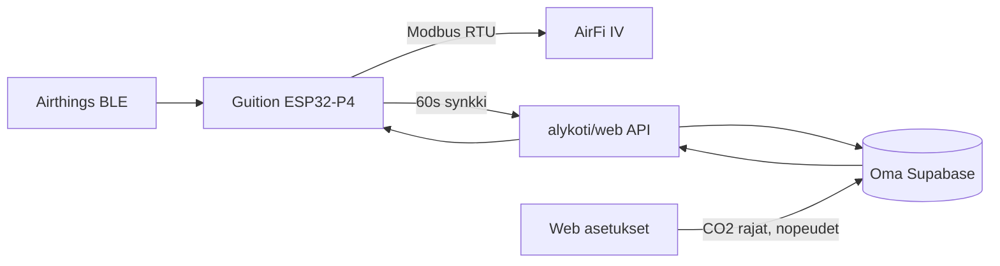

# Älykoti — täysin erillinen projekti

**Ei liity Remonttireittiin.** Oma Supabase-projekti, oma web-sovellus, oma firmware.
Remonttivalitys-repositoriossa `alykoti/` on vain kansio — ei jaeta tietokantaa,
authia tai deployausta.

## Arkkitehtuuri



| Kerros | Missä | Tehtävä |
|--------|-------|---------|
| **Keskusyksikkö** | `firmware/` | BLE, Modbus, paikallinen automaatio |
| **Supabase** | `supabase/` | Oma projekti — tila, asetukset, komennot |
| **Web** | `web/` | Mittarit, etäohjaus, **automaatioasetukset** |

## Keskusyksikkö (kuvassa)

| Osa | Malli |
|-----|-------|
| Näyttö/moduuli | JC1060P470C (10,1" kosketusnäyttö) |
| MCU | JC-ESP32P4-M3, ESP32P4N8W32 |
| Muisti | 32M PSRAM, 16M Flash |
| WiFi/BLE | ESP32-C6 (P4:llä ei omaa WiFiä) |
| Verkko | Ethernet RJ45 + WiFi |

Tarkemmin: [docs/hardware.md](docs/hardware.md)

## Kansiorakenne

```
alykoti/
  README.md
  supabase/          ← oma Supabase CLI -projekti
  web/               ← oma Next.js -sovellus
  firmware/
    hub/               ← keskusyksikkö (ESPHome)
  docs/
```

## Käyttöönotto

**Tarkat ohjeet:** [SETUP.md](SETUP.md) — Supabase linkitys, API-avaimet, firmware.

### 1. Luo Supabase-projekti

1. [supabase.com](https://supabase.com) → **New project** (esim. `alykoti-koti`)
2. Älä käytä Remonttireitin projektia

```bash
cd alykoti/supabase
supabase link --project-ref <sinun-project-ref>
supabase db push
```

### 2. Web-sovellus

```bash
cd alykoti/web
cp .env.example .env.local
npm install
npm run dev
```

Avaa `http://localhost:3001` — luo tili, lisää **keskusyksikkö** (`/keskusyksikko`), säädä ilmanvaihtoa (`/ilmanvaihto`).

### 3. Firmware

```bash
cd alykoti/firmware/hub
cp secrets.yaml.example secrets.yaml
esphome run hub.yaml
```

`sync_url` = oman web-sovelluksen API, esim.
`https://alykoti.sinunkotisi.fi/api/device/sync`

## Automaatioasetukset (web)

Webistä säädettävät arvot tallentuvat Supabaseen `hubs.config`-kenttään.
Keskusyksikkö hakee ne jokaisessa synkissä (~60 s):

| Asetus | Kuvaus |
|--------|--------|
| `co2_normal_max` | Alle tämän = normaalinopeus |
| `co2_elevated_max` | Kohonnut taso |
| `co2_high_max` | Korkea taso |
| `speed_normal` … `speed_max` | AirFi-nopeus 0–5 kullekin tasolle |

Lukemien perusteinen säätö tapahtuu keskusyksikössä — web vain määrittää rajat ja
nopeusvasteen. Manuaalinen ohjaus ja poissa-tila toimivat etänä.

## Erottelu Remonttireitistä

| | Remonttireitti | Älykoti |
|--|----------------|---------|
| Supabase-projekti | remonttireitti | **oma** |
| Web | remonttivalitys/ | **alykoti/web/** |
| Migraatiot | supabase/migrations/ | **alykoti/supabase/migrations/** |
| Deploy | Vercel remonttireitti.fi | **oma domain / portti** |
